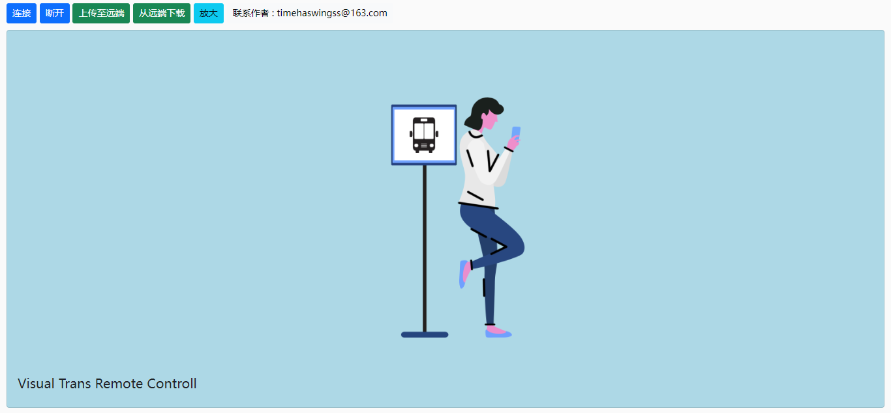

# VisualTrans

## 概述

一个简单的Windows远程控制应用程序，可通过浏览器远程控制Windows设备。

程序十分轻量，整个程序包大小仅0.6M

## 使用

1. [点这里](https://gitee.com/ignitee/visual-trans/releases)下载最新版程序压缩包
2. 将压缩包放在被控Windows设备上，并解压
3. 进入解压后的目录，右键点击VisualTrans.exe，并以**管理身份运行**程序
4. 再新打开一个命令行窗口，输入*ipconfig*查看被测设备的IP地址，并记下地址（使用其它方式查看IP也是可以的）
5. 在同一局域网的其它设备上，打开浏览器，地址栏输入：http://(被控制设备IP):9696
6. 如果成功打开网页，便可以进行远程控制了

## 原理

- 视频传输：每隔50ms通过Graphics进行截屏，并将图片发送至前端进行展示
- 远程控制：前端通过js监听鼠标与键盘事件，并将事件发送至后端程序，后端程序通过[InputSimulator](https://github.com/michaelnoonan/inputsimulator)模拟鼠标/键盘事件发送给操作系统

## 已知缺陷

- 因为频繁截图的操作，后端程序比较消耗CPU和网络资源
- 前端相对比较简陋

## 展望

- 通过RTMP进行视频传输，以节省被控设备的CPU和网络资源
- 远程控制操作尚不完善，一些组合按键的功能并没有实现
- 通过FTP文件传输替代文件上传下载功能
- 美化一下前端

（有点赞的话会继续更新，大家给个赞呗~~）